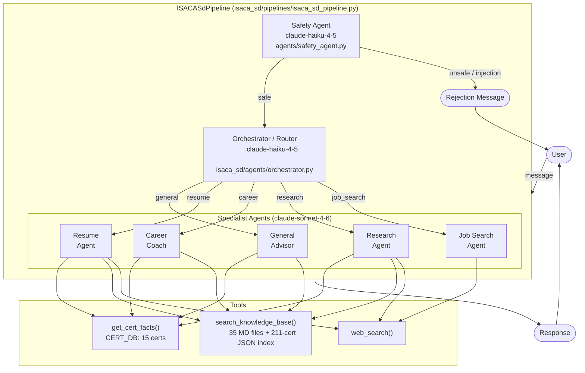
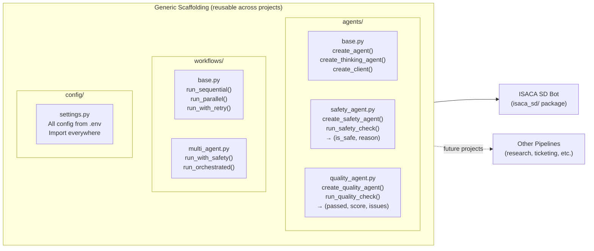
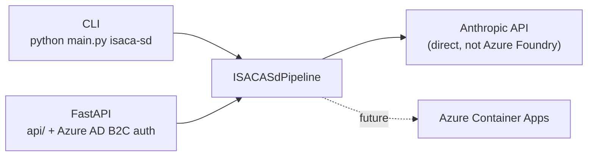

# Agentic Pipeline Factory — Architecture

## ISACA SD Bot: Multi-Agent Pipeline

### Tool Access by Agent

| Agent | get_cert_facts | search_knowledge_base | web_search |
|---|:---:|:---:|:---:|
| General Advisor | Yes | Yes | Yes |
| Resume Agent | Yes | Yes | Yes |
| Career Coach | Yes | Yes | — |
| Research Agent | Yes | Yes | Yes |
| Job Search Agent | — | — | Yes |

---

## Knowledge Base Structure

```mermaid
flowchart LR
    subgraph KB["isaca_sd/knowledge/"]
        direction TB

        subgraph MD["Markdown Files  (35 files, 299 chunks)"]
            direction TB
            ISACA["ISACA Certs
            cisa · cism · crisc · cgeit · csx-p · cdpse"]
            ISC2["ISC2 Certs
            cissp · sscp"]
            COMP["CompTIA
            sec+ · csa+ · pentest+ · casp+ · a+ · net+"]
            CLOUD["Cloud & Microsoft
            aws-sec · az-sec · sc-200 · sc-100"]
            OFF["Offensive / Forensics
            oscp · ceh · pnpt"]
            SANS["SANS/GIAC
            gsec · gcih · gpen · gwapt"]
            PRIV["Privacy / Audit
            cipp-e · cipp-us · cia · iso27001-la"]
            CISCO["Cisco
            ccna"]
            CP["Career Paths
            grc · it-audit · ciso-track · cyber-analyst"]
        end

        CI["cert-index.json
        211 certs (Paul Jerimy roadmap)
        Network · IAM · Cloud · GRC · Offensive · Forensics · SOC"]
    end

    KB --> KBT["search_knowledge_base()
    Keyword index + token scoring
    2x boost for abbreviation match"]
```

---

## Generic Scaffolding Layer

---

## Deployment Target

